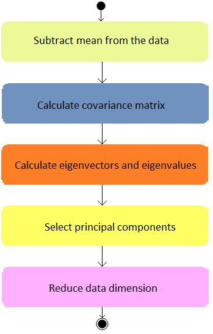
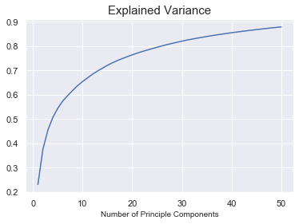
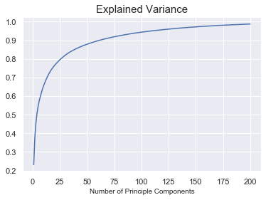

# Principal Component Analysis (PCA)- Facial Recognition 😀🤓😳🤠

Nowadays facial recognition is widely used and it is commonly used for ID verification — Face ID. For example, Apple’s Face ID is facial-recognition technology that launched on the iPhone X in 2017. Before your set up the Face ID, the iPhone will ‘scan’ your face from different angles and after you set it up, you are able to unlock your iPhones and it will also help you unlock some APPs. One more example, in some movies we saw that FIB, CIA, or similar investigation departments applied facial recognition technology to scan individuals’ pictures and obtain their information. So the question is how does facial recognition work? — The technology of facial recognition is based on the information of facial images. Facial identity features are extracted and compared with known faces to identify different faces.
# Definition
Facial recognition is a category of biometric software that maps an individual’s facial features mathematically and stores the data as a faceprint. The software uses deep learning algorithms to compare a live capture or digital image to the stored faceprint in order to verify an individual’s identity.  cite from https://searchenterpriseai.techtarget.com/definition/facial-recognition
# Principal Component Analysis (PCA)
PCA was invented in 1901 by Karl Pearson who is the creator of Pearson’s Coefficient Correlation which is a mathematical method to measure the linear relationship between variables. After Karl Person, PCA has been developed many times. PCA is an algorithm of unsupervised learning and widely used to reduce the dimension of the data. PCA is an orthogonal linear transformation which means that PCA can transform data into a new coordinate system such that the greatest variance by some scalar projection of the data comes to lie on the first principal component, the second greatest variance on the second principal component, and so on. This is also called the process of dimensional reduction. The reason why it chooses the direction of bigger variance because it could significantly compress the dimension without losing a lot of information.

`By Pablo Martin, Artelnics: https://www.neuraldesigner.com/blog/principal-components-analysis` 
# Data 
The data if from sklearn which is ready to use which means that we do not need to do the part of data cleansing and data engineering. After we load the data we can see the data is a dictionary and there are four different keys:
- The “target” is an integer from 0 to 39 indicating the identity of the person pictured. 
- The “DESCR” contains the attribute information. 
- The ‘data’ is the 2D array (400 *4096) transformed data from “image”. - The “image” contains 400 different matrics and each matric’s shape is 64 by 64 which is the “digital expression” of image. 
# Tune the number of n_component

pca.explained_variance_ratio_returns a vector of the variance explained by each dimension which also implies that the average distance between these points and the origin keeps growing when the dimension increases accordingly. Briefly speaking, our inputs data has 4096 dimensions and if we compress the inputs data into 200 dimensions, we still can obtain most information from inputs data

# Modeling
Support Vector Machines (SVM) are one of the most useful techniques in classification problems. SVM algorithm is commonly used for face recognition analysis. The code below is a simple SVM model. If you want to obtain higher accuracy you can apply GridSearch to tune the parameters. Even though best parameters were not applied in this model, the test accuracy already reached around 96%!

# Blog: https://medium.com/@melaniesoek0120/principal-component-analysis-pca-facial-recognition-5e1021f55151